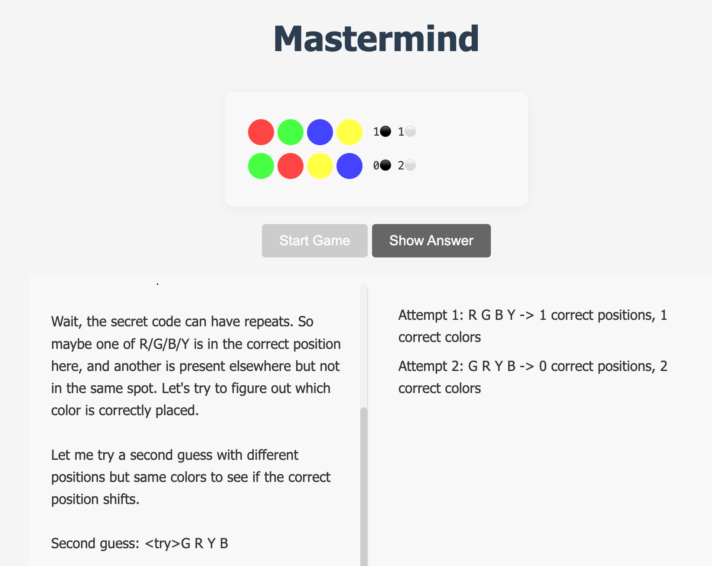
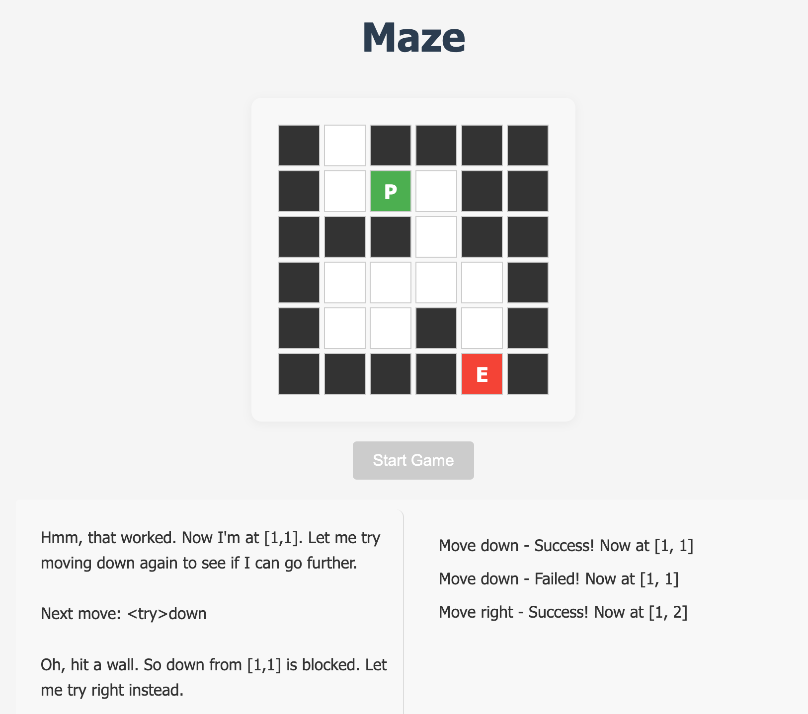

# DeepSeek Game Room

A collection of interactive games where you can watch an AI (powered by DeepSeek) solve puzzles while explaining its thought process in real-time. What's different from other AI game rooms is that this one fuses the AI's reasoning process with the game's mechanics, all the in-game interactions are in the reasoning process. It's interesting to see how the AI solves the puzzles.

## Current Games

### Mastermind
Watch as the AI attempts to crack a randomly generated color code. The AI explains its deductive reasoning process as it makes each guess and receives feedback.

Features:
- Random 4-color code using 6 different colors (Red, Green, Blue, Yellow, White, Orange)
- AI explains its thinking process for each guess
- Visual feedback with colored pegs
- Real-time updates of AI's attempts and reasoning



### Maze Solver
Observe the AI navigate through a randomly generated maze, explaining its pathfinding strategy as it explores.

Features:
- Random 6x6 maze generation with guaranteed solution
- Real-time visualization of AI's movement
- Shows AI's exploration strategy and decision making
- Visual feedback for successful/failed moves



## Setup

1. Clone the repository

```
git clone https://github.com/Noir97/DeepSeekPlayground.git
```

2. Create and activate a virtual environment (recommended)
```
python -m venv venv
source venv/bin/activate # On Windows: venv\Scripts\activate
```

3. Install dependencies
```
pip install -r requirements.txt
```

4. Set your DeepSeek API key
```
export DEEPSEEK_API_KEY="your-api-key-here"
```

5. Run the application
```
python app.py
```

## Structure
```
├── app.py # Flask application
├── requirements.txt # Python dependencies
├── runtime.txt # Python version
├── railway.toml # Railway configuration
├── Procfile # Deployment configuration
├── games/
│ ├── mastermind_game.py
│ └── maze_game.py
├── models/
│ └── deepseek_model.py
├── static/
│ ├── js/
│ │ ├── mastermind.js
│ │ └── maze.js
│ └── style.css
└── templates/
├── base.html
├── mastermind.html
└── maze.html
```

## Dependencies
- Flask
- OpenAI Python Client (for DeepSeek API)
- Python 3.8+

## Future Games (Planned)
- Battleship: AI uses search strategy with hit/miss feedback
- Hot/Cold Treasure Hunt: Navigation with temperature-based feedback
- Lock Picking Puzzle: Pattern deduction from partial information

## Contributing
Feel free to open issues or submit pull requests for improvements or bug fixes.

## License
[MIT License](LICENSE)